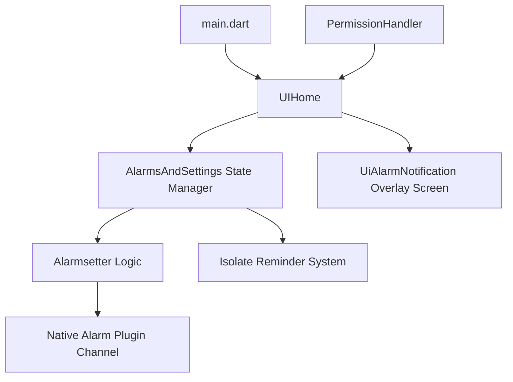

# MIST (Focus & Alarm Manager)

MIST is a premium, Obsidian-themed dark mode Alarm and Focus Reminder application built with Flutter and Native Android enhancements. It features dynamic glassmorphic widgets, precise multi-day repeating alarms, lock screen overlay alerts, and bulletproof background execution.

---

## 📂 Project Architecture & Component Map

---

The application logic is clean and decoupled into three primary tiers:

### 1. Application Initialization & Core Configuration
- **[main.dart](file:///home/yogesh/mist/lib/main.dart)**: The main entry point. Sets up the widgets binding, initializes the native `alarm` package, and registers a global `navigatorKey` on `MaterialApp` to enable contextless routing to overlays from background events.
- **[universalvariables.dart](file:///home/yogesh/mist/lib/logic/unviersalvariables.dart)**: Singleton holding global variables, including the `GlobalKey<NavigatorState>` used for navigation routing.

### 2. State & Data Layer
- **[alarmsandremainder.dart](file:///home/yogesh/mist/lib/logic/alarmsandremainder.dart)**: The central business logic singleton (`AlarmsAndSettings`).
  - Manages the active lists of alarms (`AlarmModal`) and reminders (`Remainder`) in memory.
  - Persists settings and alarm data to a JSON database at `alarms_and_settings.json`.
  - Spawns background timers in isolated Dart threads (`Isolate`) for focus countdowns.
  - Keeps local memory lists in sync with the native platform scheduler.

### 3. Alarm Execution Layer
- **[alarmsetter.dart](file:///home/yogesh/mist/lib/logic/alarmsetter.dart)**: Handles native alarm registrations.
  - Calculates upcoming DateTime offsets for single/repeating weekday alarms.
  - Resolves target asset audio tracks or custom user uploads.
  - Configures volume profiles (fixed vs. fade-in) and active vibration parameters.
  - Constructs `AlarmSettings` configurations mapped to the native platform.

### 4. Native Kotlin Bridge (Android)
- **[MainActivity.kt](file:///home/yogesh/mist/android/app/src/main/kotlin/com/example/mist/MainActivity.kt)**: Establishes `MethodChannel` endpoints for checking/requesting custom permissions:
  - Battery optimization bypass (`isBatteryOptimizationDisabled` & `requestDisableBatteryOptimization`).
  - Alarm scheduling permissions (`isExactAlarmAllowed` & `requestExactAlarmPermission`).
  - Full-screen intents (`isFullScreenIntentAllowed` & `requestFullScreenIntent`).
  - Configures window layout flags in `onCreate` and `onNewIntent` to force screen wakeup and dismiss keyguards on lock screen events.

### 5. UI & View Layer
- **[ui_home.dart](file:///home/yogesh/mist/lib/uis/android/ui_home.dart)**: Manages permission checks and navigation between Alarms, Reminders, and Settings. Listens to native ringing events and handles lifecycle changes.
- **[ui_alarm_notification.dart](file:///home/yogesh/mist/lib/uis/android/ui_alarm_notification.dart)**: The glassmorphic full-screen overlay presented when an alarm is triggered. Tracks its active visibility globally using static flags.
- **[alarms_and_settings.dart](file:///home/yogesh/mist/lib/uis/android/widgets/alarms_and_settings.dart)**: The view interface displaying list items, adding/editing sheets, and customized configuration options.

---

## 🔄 Complete Code Flow & Execution Lifecycle

### 1. App Launch & Permission Verification
1. `main()` calls `await Alarm.init()` which restores saved database configurations in the native plugin.
2. `MaterialApp` renders `UIHome` as the root screen.
3. In `initState()`, `PermissionHandler` checks:
   - System Notifications (`POST_NOTIFICATIONS`)
   - Storage Read/Write permissions
   - Precise Alarms (`SCHEDULE_EXACT_ALARM`)
   - Background Pop-up overlays (`SYSTEM_ALERT_WINDOW`)
   - Full-Screen Alerts (`USE_FULL_SCREEN_INTENT`)
   - Battery Saver Whitelist (`REQUEST_IGNORE_BATTERY_OPTIMIZATIONS`)
4. If any mandatory permission is missing, `UIHome` redirects the view to `UiPermissionRequestScreen`. Tapping cards calls the native Kotlin layer to launch specific OS settings panels.
5. Once all permissions are verified, the dashboard content is drawn.

### 2. Scheduling an Alarm
1. The user inputs an alarm title, time (HH:MM AM/PM), and repetition constraints (`Once` or specific days of the week like `Mon`, `Wed`, `Fri`) in the edit sheet.
2. `AlarmsAndSettings.addAlarm()` is invoked.
3. It calls `Alarmsetter.calculateNextRepeatDateTime()` to schedule the alarm:
   - If set to **Once** and the target time has passed for today, it returns tomorrow's date.
   - If set to **Repeat Days**, it evaluates the current weekday. It looks ahead day-by-day (up to 7 days). If it hits a selected weekday in the future (or today if the time hasn't passed yet), it returns that date.
4. `Alarmsetter` compiles the `AlarmSettings` payload (including a JSON string serialized representation of the alarm in the payload metadata) and triggers `Alarm.set()`.
5. The native plugin writes the settings to storage and registers an exact wake-up event in Android's `AlarmManager`.

### 3. Alarm Ringing & Screen Wakeup
1. When the registered time matches, `AlarmReceiver` in Android catches the broadcast.
2. It wakes up the CPU using a wake lock and starts `AlarmService`.
3. `AlarmService` triggers:
   - Audio playing via a media player (applying volume fades if enabled).
   - Phone vibration patterns.
   - Displays a high-priority system notification.
4. **Lock Screen Handling**: The system fires the `fullscreenIntent` attached to the notification. This launches `MainActivity` with high-priority window flags:
   - `setShowWhenLocked(true)` and `FLAG_SHOW_WHEN_LOCKED` force the app to render over the keyguard.
   - `setTurnScreenOn(true)` and `FLAG_TURN_SCREEN_ON` illuminate the display.
   - `requestDismissKeyguard()` prompts the keyboard/swipe dialog.
5. In Flutter, `MainActivity` launches/resumes the engine. The app enters the `resumed` lifecycle state.

### 4. Ringing State Synchronization & Route Pushing
1. When the alarm starts ringing, the plugin notifies Flutter, updating the `Alarm.ringing` stream.
2. If the app is already open, the `Alarm.ringing.listen()` callback in `_UIHomeState` triggers immediately.
3. If the app was closed or in the background and is opened via a notification click or lock screen unlock, `didChangeAppLifecycleState(AppLifecycleState.resumed)` is called:
   - `AlarmsAndSettings.instance.getData()` executes to synchronize data.
   - **Sync Reschedule Guard**: To prevent the synchronization loop from stopping the actively ringing alarm (which is not in the native pending queue and would normally get rescheduled), we check if the alarm is currently ringing natively, local to the stream, or visible on screen. If any is true, rescheduling is skipped.
   - `_checkAndShowRingingAlarm()` runs: It checks the `Alarm.ringing` stream and proactively checks `Alarm.isRinging(id)` natively for all saved alarms.
4. If a ringing alarm is detected, `_showAlarmOverlay` is called:
   - Uses the global static flag `UiAlarmNotification.active` to verify the ringing screen is not already open (preventing duplicates).
   - Deserializes the full modal model from the notification's JSON payload.
   - Navigates to the `UiAlarmNotification` screen using `navigatorKey.currentState`.

### 5. Alarm Dismissal & Repetition Loop
1. The user taps **"Dismiss Alarm"** on the ringing overlay screen.
2. The click handler triggers:
   - If the alarm's `repeatType` is **Once**, it flags `alarm.isActive = false` (it will not ring again).
   - If the alarm is **Repeating**, it keeps `alarm.isActive = true`.
3. `AlarmsAndSettings.instance.updateAlarm(alarm)` is called:
   - It stops the currently ringing instance using `Alarm.stop(id)`.
   - It saves the updated state to the local JSON database.
   - If the alarm is still active (repeating), it automatically schedules the next occurrence (e.g. rescheduling to Friday when Monday's alarm is dismissed) by calculating the next future weekday date and calling `Alarm.set()`.
4. The route is popped, resetting the global static active flags.
