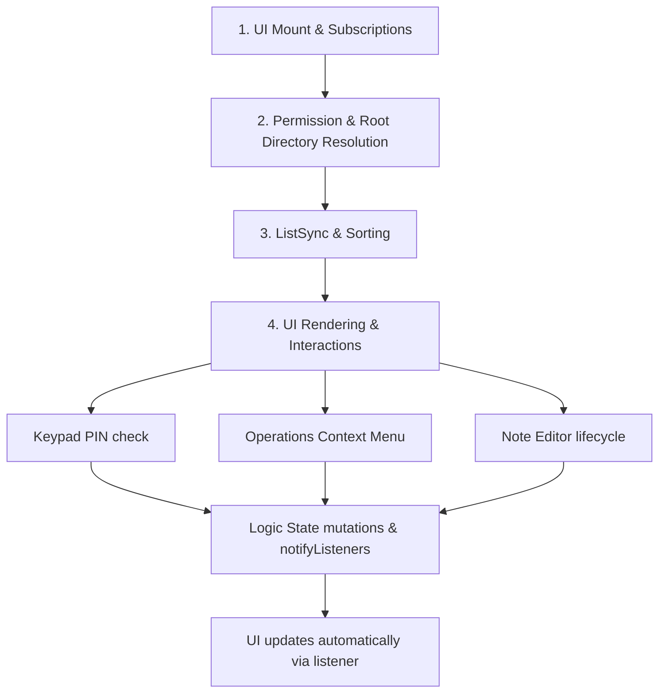

# MIST File Explorer & Vault Flow Documentation (Separated Architecture)

This document describes the modern, separated architecture of the MIST Local File Explorer. The logic, state, and filesystem helpers have been decoupled from the visual layers into a dedicated state-management class: [CodeFolder](file:///home/yogesh/mist/lib/logic/code_folder.dart).

---

## 🏗️ Architecture Overview

The codebase is split into two key layers:
1. **Logic Layer ([CodeFolder](file:///home/yogesh/mist/lib/logic/code_folder.dart))**: 
   - Inherits from `ChangeNotifier`.
   - Manages state variables (loading status, directories, items lists, decoy flags).
   - Executes storage initialization, file system operations (CRUD, move/copy tree operations), permission checks, and vault metadata parsing.
2. **UI Layer ([UiFolderScreen](file:///home/yogesh/mist/lib/uis/android/ui_folder.dart))**: 
   - A `StatefulWidget` that instantiates `CodeFolder` and subscribes to state updates.
   - Builds custom pages, keypads, operation bottom sheets, and markdown note editors.

---

## 🗺️ Step-by-Step Execution Flow & Function Directory



---

### Step 1: UI Mount & Logic Binding

When `UiFolderScreen` is mounted, it establishes listener bindings to re-render reactively whenever the logic state updates.

#### `initState()`
* **Role**: Widget lifecycle initialization.
* **Flow**:
  1. Instantiates `final CodeFolder _logic = CodeFolder();`.
  2. Registers the state-rebuild listener: `_logic.addListener(_updateState);`.
  3. Uses `WidgetsBinding.instance.addPostFrameCallback` to trigger `_logic.checkPermissionAndInit()` immediately after the first frame completes.

#### `dispose()`
* **Role**: Cleanup.
* **Flow**: Unregisters the state update listener (`_logic.removeListener(_updateState)`) and disposes of the logic controller (`_logic.dispose()`).

---

### Step 2: Permission & Storage Root Verification

This step resolves device storage paths and permissions asynchronously.

#### `checkPermissionAndInit()` (in `CodeFolder`)
* **Role**: Access handler.
* **Flow**:
  1. Calls `PermissionHandler().checkStoragePermission()`.
  2. Assigns result to `isStoragePermissionGranted` and calls `notifyListeners()`.
  3. If granted -> calls `initVaultDirectory()`.
  4. If denied -> updates `isLoading = false` and calls `notifyListeners()`.

#### `initVaultDirectory()` (in `CodeFolder`)
* **Role**: Prepares local directory pathing.
* **Flow**:
  1. Configures `isLoading = true` and alerts listeners.
  2. Detects device platforms: uses Android external storage roots or falls back to standard documents directory storage.
  3. Ensures base directory `/StudentMist` exists on disk.
  4. Sets `currentDirectory = baseDirectory` and invokes `refreshFiles()`.

---

### Step 3: Local Directory Listing & Formatting

Prepares the sorted list of files and decoy subdirectories to feed into the UI grid.

#### `refreshFiles({void Function(String err)? onError})` (in `CodeFolder`)
* **Role**: Syncs local storage directory contents.
* **Flow**:
  1. Inspects the `effectiveDirectory` getter to determine target pathing.
  2. If decoy session is active, maps to the hidden `/.decoy_data` subfolder, creating a default note file `Public Study Notes.txt` if none exist.
  3. Lists children entities on disk using `dir.listSync()`.
  4. Discards files starting with a dot `.` (hidden configurations and JSON vault metadata).
  5. Sorts the list so directories appear first, followed by note files alphabetically.
  6. Updates `items = sortedList` and calls `notifyListeners()`.

#### `effectiveDirectory` (Getter in `CodeFolder`)
* **Role**: Decoy router.
* **Flow**: Checks the boolean flag `isDecoyActive`. If true, redirects file loading requests to the decoy directory path.

---

### Step 4: UI Grid & Interaction Maps

Translates the memory state of `CodeFolder` into user interfaces and custom widgets.

#### `build(BuildContext context)` (in `UiFolderScreen`)
* **Role**: Constructs scaffold hierarchy.
* **Flow**: Reads `_logic.isLoading` to render progress spinner, `_logic.isStoragePermissionGranted` to show permission request alerts, or maps `_logic.items` directly into `TactileVaultCard` item grids.

#### Navigation & Back Tracing
* **`_logic.navigateToDirectory(Directory dir, {bool? keepDecoy})`**: Sets the new path, handles decoy state propagation, and refreshes directory files.
* **`_logic.goBack()`**: Computes parent directories (`currentDirectory!.parent`) and navigates backward unless at base directory root (`_logic.isRoot`).

---

### Step 5: Secure Vaults & Keypad Modals

Validates locks, PIN credentials, decoy sessions, and recovery settings.

#### `isFolderLocked(Directory dir)` & `getFolderPIN(Directory dir)` (in `CodeFolder`)
* **Role**: Parses locking config inside directory paths.
* **Flow**: Deserializes JSON config values inside a hidden `.vault_meta` file.

#### `_showPINPadModal(Directory dir)` (in `UiFolderScreen`)
* **Role**: key inputs overlay interface.
* **Flow**:
  1. Loads locked folder credentials from `_logic`.
  2. Checks user PIN input:
     - Input matches Master PIN ➡️ Sets `_logic.isDecoyActive = false`, invokes `_logic.navigateToDirectory()`.
     - Input matches Decoy PIN ➡️ Sets `_logic.isDecoyActive = true`, invokes `_logic.navigateToDirectory(keepDecoy: true)`.
     - Otherwise, prompts error toasts and clears inputs.

#### `_showRecoveryDialog(Directory dir)` (in `UiFolderScreen`)
* **Role**: Recovery handler.
* **Flow**: Queries recovery question fields from `_logic.getVaultRecoveryInfo(dir)`. Correct answers pop up a dialog revealing the true vault PIN.

---

### Step 6: File System CRUD Operations (Logic Invocations)

User selections from bottom sheets are processed in UI handlers and routed directly to `CodeFolder`.

```dart
// Examples of separated operations:

Future<void> _createNewFolder(String name) async {
  final err = await _logic.createNewFolder(name);
  if (err != null) {
    _showPremiumToast(err, isError: true);
  } else {
    _showPremiumToast("Folder '$name' created successfully!");
  }
}

Future<void> _deleteEntity(FileSystemEntity entity) async {
  final name = entity.path.split('/').last.replaceAll(".txt", "");
  final err = await _logic.deleteEntity(entity);
  if (err != null) {
    _showPremiumToast(err, isError: true);
  } else {
    _showPremiumToast("'$name' deleted successfully.");
  }
}
```

* **Folder Creation** (`_logic.createNewFolder`): Verifies unique folder paths, creates folders on disk, and runs directory refreshes.
* **Vault Generation** (`_logic.createNewVault`): Creates standard folders and writes custom `.vault_meta` JSON lock metadata configurations.
* **Copy & Move Infrastructure**:
  - `_logic.getAllSubfolders()` traverses folders recursively.
  - Tapping targets validates access (`_verifyVaultAccessAndExecute`) and executes `_logic.copyEntity` / `_logic.moveEntity` under the hood.

---

### Step 7: Markdown Note Editor & Toast System

* **`StudyNoteEditorScreen`**: Takes a standard `File` parameter. On exit, writes body changes to disk (`writeAsString`), checks if the note title was updated to rename the file entity, and calls `onSave: () => _logic.refreshFiles()` before closing.
* **`_showPremiumToast`**: Renders dynamic animated toast alerts by injecting a slide-in `PremiumToastWidget` directly into the overlay layer of the screen context.
